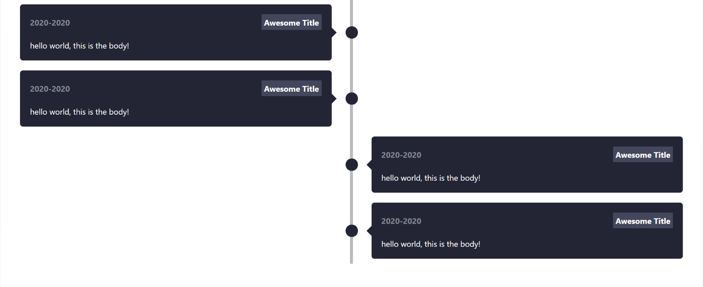

# React Timeline

Reusable react components to create a good looking and responsive timeline out the box!

## Table of contents

- [Installation](#installation)
- [Usage](#usage)
- [Available Props](#available-props)

## Installation

### npm

```bash
npm install react-timelinev2
```

### Yarn

```bash
yarn add react-timelinev2
```

## Usage

```js
import React from "react";
import { Timeline, TimelineItem } from "react-timelinev2";

function App() {
  return (
    <div className="App">
      <Timeline>
        <TimelineItem side="left" title="hello world" date="2020">
          Some text
        </TimelineItem>
        <TimelineItem shadows hoverShadow side="left" title="hello world" date="2020">
          I will have shadows!
        </TimelineItem>
        <TimelineItem side="right" title="hello world" date="2020">
          Some text
        </TimelineItem>
        <TimelineItem side="right" title="hello world" date="2020">
          Some text
        </TimelineItem>
      </Timeline>
    </div>
  );
}
```

## Screenshot



## Playground

<https://codesandbox.io/s/k2ix2>

## Available Props

### Timeline

| Option     | type   | description                             | required |
| ---------- | ------ | --------------------------------------- | -------- |
| timelineBg | string | Set a background color for the timeline | false    |

### TimelineItem

| Option        | type    | description                                  | required |
| ------------- | ------- | -------------------------------------------- | -------- |
| title         | string  | set the title                                | true     |
| side          | string  | `left` or `right`                            | true     |
| date          | string  | set a date                                   | true     |
| bgColor       | string  | set a background color for the timeline item | false    |
| bodyTextColor | string  | Set a color for the body text                | false    |
| dateColor     | string  | Set a color for date                         | false    |
| titleBg       | string  | Set a background color for the title         | false    |
| titleColor    | string  | Set a color for title                        | false    |
| borderRadius  | string  | Set a border radius for the timeline item    | false    |
| shadows       | boolean | Sets a box-shadow                            | false    |
| hoverShadow   | boolean | Sets a box-shadow on hover only              | false    |

## Supporting react-timelinev2

**All stars/forks are appreciated!**

Made with ❤ and TypeScript

## License

[MIT](./LICENSE)
